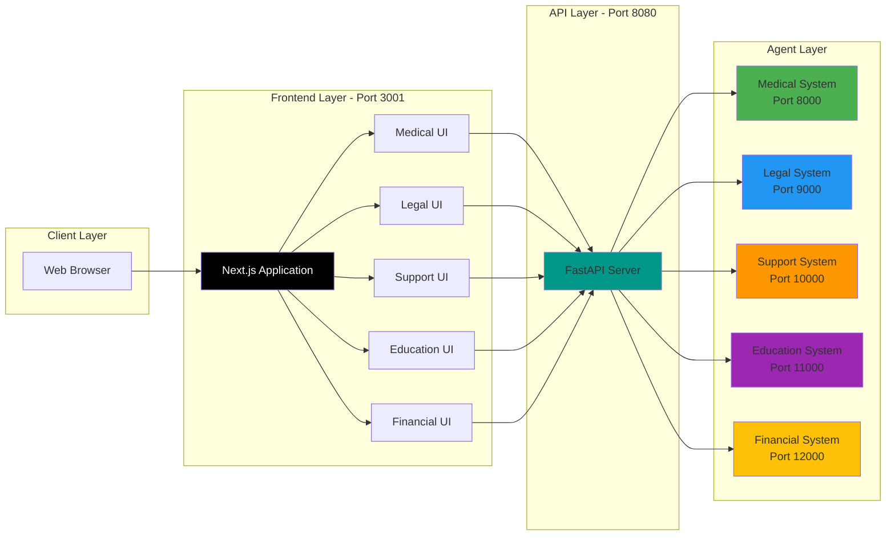
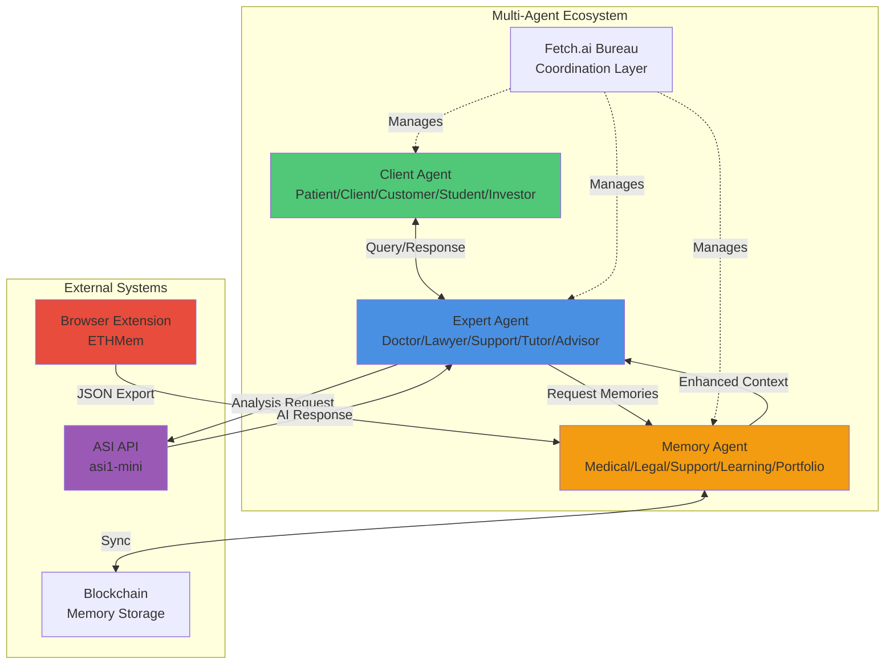
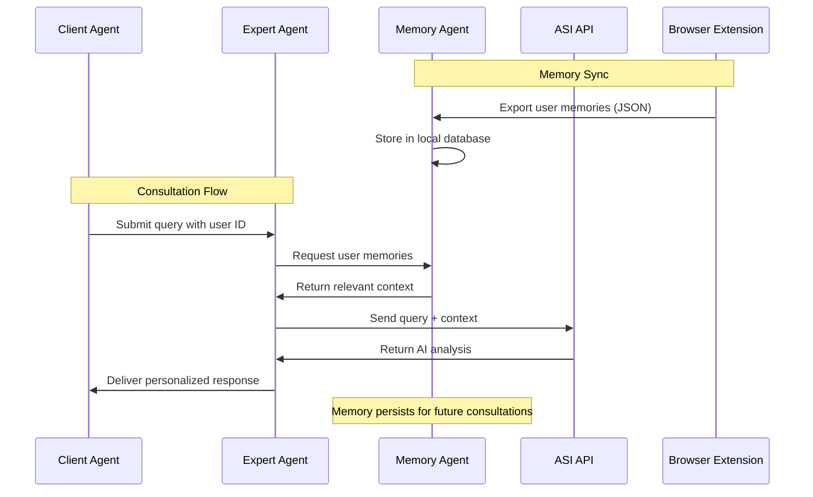
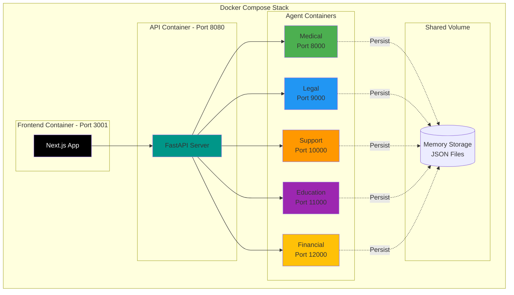
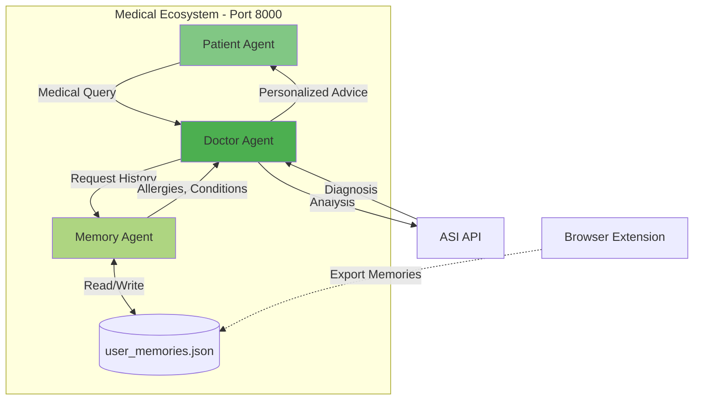
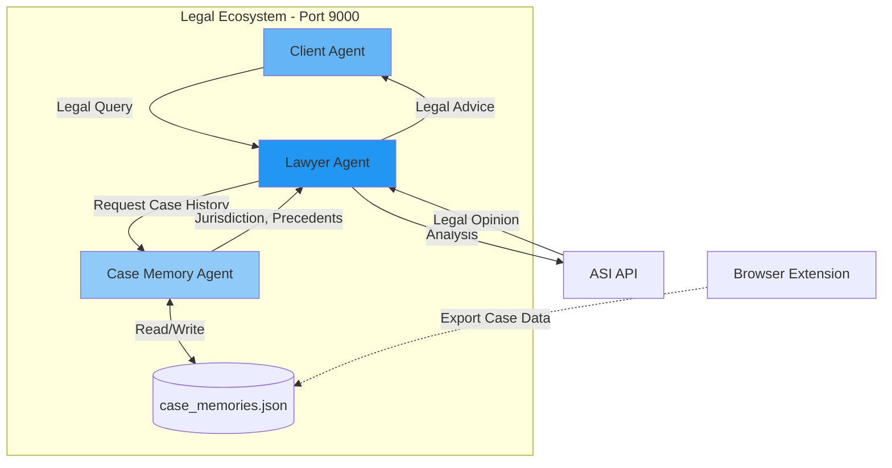
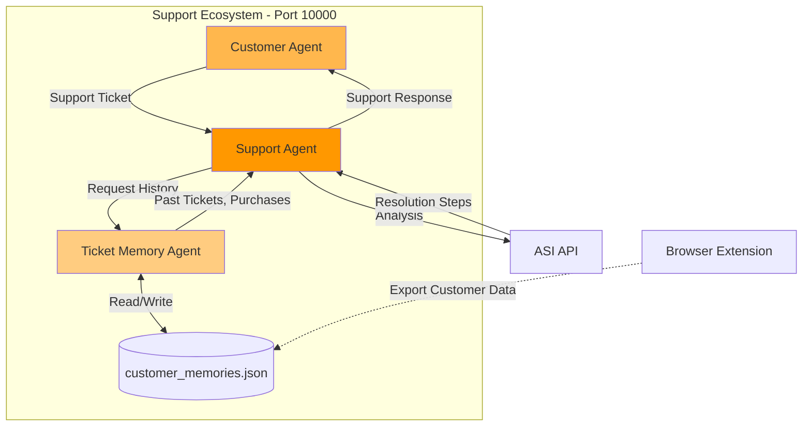
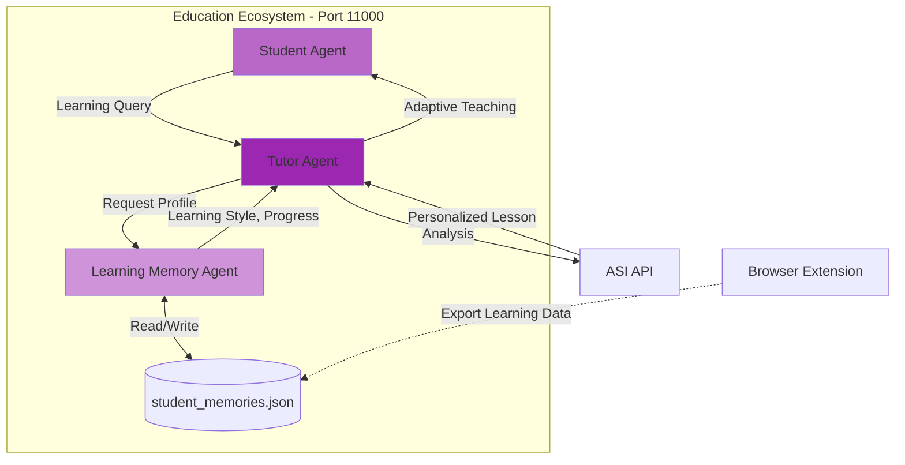
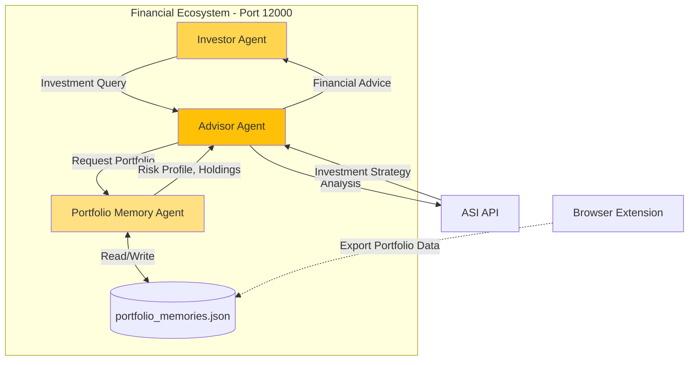

# ASI-Agents: Multi-Domain AI Agent Ecosystems

[](https://opensource.org/licenses/MIT)
[](https://www.python.org/downloads/)
[](https://fetch.ai/)
[](https://asi1.ai)
[](https://nextjs.org/)

> **Five Complete Agent Ecosystems** - Medical | Legal | Customer Support | Education | Financial
> 
> All Powered by ASI and Memory Integration
>
> **Now with Web Frontend**

<p align="center">
  
  
  
  
  
</p>

---

## Overview

Welcome to **ASI-Agents** - a comprehensive collection of **five independent multi-agent systems**, each designed for a specific domain but sharing the same powerful architecture:

- **Medical Consultation System** - AI-powered healthcare consultations with personalized medical memory
- **Legal Consultation System** - Intelligent legal advice with case history integration
- **Customer Support System** - Smart customer service with support ticket memory
- **Education System** - Personalized AI tutoring with adaptive learning profiles
- **Financial Advisory System** - Portfolio analysis and investment guidance with risk profiling

Each ecosystem is **completely independent** yet follows the **same architecture pattern**, making it easy to understand, extend, and deploy any or all of them.

### Web Interface

Access all agents through a modern web interface:
- **Frontend**: Next.js application with responsive design (Port 3001)
- **API Server**: FastAPI backend providing unified REST APIs (Port 8080)
- **Real-time Memory Integration**: View user history alongside consultations
- **Docker Support**: One-command deployment of entire stack



**Quick Start:**
```bash
./start-frontend.sh
# or
docker-compose up
```

Then visit: **http://localhost:3001**

---

## Project Structure

```
ASI-agents/
├── README.md                    # This file - Main overview
├── FRONTEND_GUIDE.md            # Frontend & API documentation
├── requirements.txt             # Shared Python dependencies
├── docker-compose.yml           # Docker orchestration for all services
├── api_server.py                # FastAPI backend (Port 8080)
├── start-frontend.sh            # Quick start script for web interface
│
├── frontend/                    # Next.js Web Interface (Port 3001)
│   ├── app/
│   │   ├── page.jsx             # Home page with agent cards
│   │   ├── medical/page.jsx     # Medical consultation UI
│   │   ├── legal/page.jsx       # Legal consultation UI
│   │   ├── support/page.jsx     # Customer support UI
│   │   ├── education/page.jsx   # Education tutoring UI
│   │   ├── financial/page.jsx   # Financial advisory UI
│   │   └── components/          # Shared React components
│   ├── package.json
│   ├── Dockerfile
│   └── README.md
│
├── medical/                     # Medical Consultation Ecosystem
│   ├── doctor_agent.py          # AI doctor agent
│   ├── patient_agent.py         # Patient simulation agent
│   ├── memory_agent.py          # Medical memory management
│   ├── medical_system.py        # Bureau-managed system (Port 8000)
│   ├── user_memories.json       # Medical memory storage
│   ├── ARCHITECTURE.md          # Medical system architecture
│   └── README.md                # Medical system documentation
│
├── law/                         # Legal Consultation Ecosystem
│   ├── lawyer_agent.py          # AI lawyer agent
│   ├── client_agent.py          # Client simulation agent
│   ├── case_memory_agent.py     # Legal memory management
│   ├── law_system.py            # Bureau-managed system (Port 9000)
│   ├── case_memories.json       # Legal case memory storage
│   └── ARCHITECTURE.md          # Legal system architecture
│
├── customer-support/            # Customer Support Ecosystem
│   ├── support_agent.py         # AI support agent
│   ├── customer_agent.py        # Customer simulation agent
│   ├── ticket_memory_agent.py   # Support memory management
│   ├── support_system.py        # Bureau-managed system (Port 10000)
│   ├── customer_memories.json   # Customer memory storage
│   └── ARCHITECTURE.md          # Support system architecture
│
├── education/                   # Education Ecosystem
│   ├── tutor_agent.py           # AI tutor agent
│   ├── student_agent.py         # Student simulation agent
│   ├── learning_memory_agent.py # Learning profile management
│   ├── education_system.py      # Bureau-managed system (Port 11000)
│   ├── student_memories.json    # Student learning profiles
│   └── ARCHITECTURE.md          # Education system architecture
│
└── financial/                   # Financial Advisory Ecosystem
    ├── advisor_agent.py         # AI financial advisor agent
    ├── investor_agent.py        # Investor simulation agent
    ├── portfolio_memory_agent.py # Portfolio memory management
    ├── financial_system.py      # Bureau-managed system (Port 12000)
    ├── portfolio_memories.json  # Portfolio memory storage
    └── ARCHITECTURE.md          # Financial system architecture
```

---

## Shared Architecture

All five ecosystems follow the **same proven architecture**:



### System Flow



### Key Components (Same for All)

1. **Expert Agent** - Provides specialized advice (Medical/Legal/Support/Education/Financial)
2. **Client Agent** - Simulates user interactions
3. **Memory Agent** - Manages personalized user/case/customer/learning/portfolio history
4. **Bureau System** - Coordinates all agents in the ecosystem
5. **ASI API Integration** - Powers intelligent analysis and responses
6. **Protocol Communication** - Structured agent-to-agent messaging

---

## Quick Start

### Prerequisites

- Python 3.13 or higher
- ASI API key from [asi1.ai](https://asi1.ai)
- pip package manager
- Internet connection for agent communication

### Installation

```bash
# Clone the repository
git clone https://github.com/ekas-7/ETHMem.git
cd ETHMem/ASI-agents

# Run setup script (creates .env, installs dependencies)
chmod +x setup.sh
./setup.sh

# Or install manually
python3 -m venv venv
source venv/bin/activate  # Linux/Mac | venv\Scripts\activate on Windows
pip install -r requirements.txt

# Configure your ASI API key
echo "ASI_ONE_API_KEY=your_asi_api_key_here" > .env
```

### Run Any Ecosystem

#### Option 1: Docker (Recommended for Production)



Run all systems with Docker Compose:

```bash
# Copy and configure environment
cp .env.example .env
# Edit .env with your ASI_ONE_API_KEY

# Start all systems
docker-compose up -d

# Or use the Makefile
make all

# Start individual systems
make medical    # Port 8000
make law        # Port 9000
make support    # Port 10000
make education  # Port 11000
make financial  # Port 12000

# View logs
docker-compose logs -f

# Stop all systems
docker-compose down
```

**See [DOCKER.md](DOCKER.md) for complete Docker documentation.**

#### Option 2: Direct Python Execution

Each ecosystem can run **completely independently**:

```bash
# Medical System (Port 8000)
cd medical
python medical_system.py

# Legal System (Port 9000)
cd law
python law_system.py

# Customer Support System (Port 10000)
cd customer-support
python support_system.py

# Education System (Port 11000)
cd education
python education_system.py

# Financial Advisory System (Port 12000)
cd financial
python financial_system.py
```

---

## Medical Consultation System

**Purpose**: AI-powered medical consultations with personalized health memory integration.

### Features

- Symptom analysis and preliminary diagnosis
- Personalized recommendations based on medical history
- Allergy and condition awareness
- Urgency assessment and triage
- Medical memory integration from browser extension

### Architecture



### Example Use Case

```python
# Patient reports symptoms
query = MedicalQuery(
    patient_id="PAT-001",
    symptoms="fever and cough for 3 days",
    urgency_level="normal"
)

# Doctor agent:
# 1. Requests medical memories (allergies, conditions)
# 2. Analyzes symptoms using ASI API
# 3. Returns personalized medical advice with precautions
```

**[Full Documentation →](medical/README.md)** | **[Architecture →](medical/ARCHITECTURE.md)**

---

## Legal Consultation System

**Purpose**: Intelligent legal consultations with case history and jurisdiction awareness.

### Features

- Legal case analysis and preliminary assessment
- Jurisdiction-specific legal advice
- Case precedent and history integration
- Contract review and analysis
- Legal risk assessment

### Architecture



### Example Use Case

```python
# Client seeks legal advice
query = LegalQuery(
    client_id="CLIENT-001",
    case_type="contract_dispute",
    jurisdiction="California",
    description="Breach of contract with vendor"
)

# Lawyer agent:
# 1. Retrieves case history and jurisdiction info
# 2. Analyzes legal issues using ASI API
# 3. Provides jurisdiction-specific legal guidance
```

**[Architecture →](law/ARCHITECTURE.md)**

---

## Customer Support System

**Purpose**: Smart customer service with intelligent ticket resolution and customer history.

### Features

- Ticket creation and management
- Customer history tracking
- Priority assessment based on urgency
- Personalized support responses
- Issue pattern recognition

### Architecture



### Example Use Case

```python
# Customer reports issue
ticket = SupportQuery(
    customer_id="CUST-001",
    issue_type="technical_issue",
    priority="high",
    description="Cannot access account after password reset"
)

# Support agent:
# 1. Retrieves customer purchase history and past tickets
# 2. Assesses priority and urgency
# 3. Generates step-by-step resolution using ASI API
```

**[Architecture →](customer-support/ARCHITECTURE.md)**

---

## Education System

**Purpose**: Personalized AI tutoring with adaptive learning and student profiling.

### Features

- Personalized tutoring based on learning style (visual/auditory/kinesthetic)
- Subject mastery tracking
- Adaptive difficulty adjustment
- Learning pattern recognition
- Progress monitoring and feedback

### Architecture



### Example Use Case

```python
# Student asks for help
query = TutoringQuery(
    student_id="STU-001",
    subject="mathematics",
    topic="quadratic equations",
    difficulty="intermediate"
)

# Tutor agent:
# 1. Retrieves learning profile (visual learner, struggles with algebra)
# 2. Adapts explanation style to student's learning preferences
# 3. Uses ASI API to generate personalized examples and exercises
```

**[Architecture →](education/ARCHITECTURE.md)**

---

## Financial Advisory System

**Purpose**: Portfolio analysis and investment guidance with personalized risk profiling.

### Features

- Portfolio analysis and optimization
- Risk-based investment recommendations
- Goal-based financial planning
- Market trend analysis
- Asset allocation strategies (Conservative/Moderate/Aggressive)

### Architecture



### Example Use Case

```python
# Investor seeks advice
query = FinancialQuery(
    investor_id="INV-001",
    query_type="portfolio_review",
    risk_tolerance="moderate",
    time_horizon="long_term"
)

# Advisor agent:
# 1. Retrieves portfolio allocation and investment goals
# 2. Analyzes risk profile and time horizon
# 3. Uses ASI API to generate personalized investment recommendations
```

**[Architecture →](financial/ARCHITECTURE.md)**

---

## Ecosystem Comparison

| Feature | Medical | Legal | Support | Education | Financial |
|---------|-----------|----------|------------|--------------|--------------|
| **Expert Agent** | Doctor | Lawyer | Support Agent | Tutor | Financial Advisor |
| **Client Agent** | Patient | Client | Customer | Student | Investor |
| **Memory Focus** | Medical History | Case History | Ticket History | Learning Profile | Portfolio Data |
| **Key Use Cases** | Diagnosis, Treatment | Legal Advice, Case Analysis | Issue Resolution | Personalized Tutoring | Investment Advice |
| **Risk Assessment** | Urgency Triage | Legal Risk | Priority Level | Difficulty Level | Risk Tolerance |
| **Personalization** | Allergies, Conditions | Jurisdiction, Precedents | Purchase History | Learning Style | Risk Profile, Goals |
| **Port** | 8000 | 9000 | 10000 | 11000 | 12000 |

---

## Configuration

### Environment Variables

Create a `.env` file in the root directory:

```env
# ASI API Configuration
ASI_ONE_API_KEY=your_asi_api_key_here

# Optional: Agentverse Configuration (for mailbox feature)
AGENTVERSE_API_KEY=your_agentverse_key
DOCTOR_MAILBOX_KEY=doctor_mailbox_key
PATIENT_MAILBOX_KEY=patient_mailbox_key
# ... (add for other ecosystems as needed)
```

### Memory Storage

Each ecosystem uses JSON-based memory storage:

- **Medical**: `medical/user_memories.json`
- **Legal**: `law/case_memories.json`
- **Support**: `customer-support/customer_memories.json`
- **Education**: `education/student_memories.json`
- **Financial**: `financial/portfolio_memories.json`

These files are auto-created with sample data on first run and can be populated from browser extension exports.

---

## Development

### Project Dependencies

```
uagents>=0.12.0          # Fetch.ai multi-agent framework
requests>=2.31.0         # HTTP client for ASI API
python-dotenv>=1.0.0     # Environment variable management
aiohttp                  # Async HTTP for agent communication
pydantic                 # Data validation
cosmpy                   # Cosmos blockchain integration
```

### Adding a New Ecosystem

1. Create a new directory under `ASI-agents/`
2. Implement 3 agents following the pattern:
   - Expert agent (with ASI API integration)
   - Client agent (user simulation)
   - Memory agent (with JSON storage)
3. Create Bureau system coordinator
4. Add ARCHITECTURE.md documentation
5. Update `setup.sh` with new ecosystem
6. Add to this README

---

## Documentation

- **[Medical System Architecture](medical/ARCHITECTURE.md)** - Detailed medical consultation system design
- **[Medical System README](medical/README.md)** - User guide for medical system
- **[Legal System Architecture](law/ARCHITECTURE.md)** - Legal consultation system design
- **[Customer Support Architecture](customer-support/ARCHITECTURE.md)** - Support system design
- **[Education System Architecture](education/ARCHITECTURE.md)** - Tutoring system design
- **[Financial Advisory Architecture](financial/ARCHITECTURE.md)** - Financial advisory system design

---

## Roadmap

### Completed
- [x] Medical Consultation System with memory integration
- [x] Legal Consultation System with case history
- [x] Customer Support System with ticket management
- [x] Education System with adaptive learning
- [x] Financial Advisory System with portfolio analysis
- [x] ASI API integration across all ecosystems
- [x] Protocol-based agent communication
- [x] Comprehensive architecture documentation

### Planned
- [ ] Web dashboard for all ecosystems
- [ ] Real-time blockchain memory sync (ETHMem integration)
- [ ] Multi-language support
- [ ] Voice interface for all agents
- [ ] Mobile app integration
- [ ] Analytics and insights dashboard
- [ ] Multi-agent collaboration (cross-ecosystem)
- [ ] Enterprise deployment options

---

## Contributing

Contributions are welcome! Please feel free to submit a Pull Request.

1. Fork the repository
2. Create your feature branch (`git checkout -b feature/AmazingFeature`)
3. Commit your changes (`git commit -m 'Add some AmazingFeature'`)
4. Push to the branch (`git push origin feature/AmazingFeature`)
5. Open a Pull Request

---

## License

This project is licensed under the MIT License - see the [LICENSE](LICENSE) file for details.

---

## Acknowledgments

- **Fetch.ai** - For the uAgents framework and Agentverse platform
- **ASI** - For the powerful ASI API
- **ETHMem** - For blockchain-based memory storage integration

---

## Support

For questions, issues, or feature requests:

- Open an issue on [GitHub](https://github.com/ekas-7/ETHMem/issues)
- Check individual system README files for specific documentation
- Review ARCHITECTURE.md files for technical details

---

<p align="center">
  Built using Fetch.ai uAgents and ASI API
</p>

<p align="center">
  <strong>Five Ecosystems. One Architecture. Infinite Possibilities.</strong>
</p>
