# EthMem - Decentralized Memory for AI Interactions

[](https://opensource.org/licenses/MIT)
[](https://nextjs.org/)
[](https://soliditylang.org/)
[](https://www.python.org/)
[](https://developer.chrome.com/docs/extensions/)
[](https://hedera.com/)

> **Unified LLM Memory — Your Blockchain Identity**
> 
> Transform your AI conversations into a portable, cryptographically-secured digital identity that you own and control.

---

## Overview

**EthMem** unlocks a new layer of digital continuity by turning a user's LLM interactions into a portable, cryptographically-secured identity. Your conversations, learned context, and personal insights can be carried across applications while remaining under your complete ownership.

### System Architecture


### Key Principles

**Private-by-Design**
- No central servers required for identity storage
- All processing happens locally in your browser
- You control who accesses your memories

**Portable**
- Memory can be used across compatible applications
- Export and import between devices
- Platform-agnostic storage format

**Verifiable**
- Cryptographic proofs bind memory to your identity
- Blockchain anchoring ensures authenticity
- Tamper-proof audit trail

**Decentralized**
- IPFS-based storage for data availability
- Smart contract coordination on Ethereum/Hedera
- No single point of failure

### Value Proposition

Claim your decentralized memory and never lose context again. Experience truly personalized AI that remembers your preferences, adapts to your style, and respects your privacy.

---

## Repository Structure

This repository contains five major components that work together to create the EthMem ecosystem:


### Project Structure

```
ETHMem/
├── frontend/              # Next.js web application
├── extension/             # Browser extension for ChatGPT/Claude/Gemini
├── smart-contract/        # Ethereum smart contracts for memory storage
├── ASI-agents/            # AI agent ecosystems (Medical, Legal, Support, Education, Financial)
└── hedera/                # Hedera-based e-commerce negotiation system
```

---

## Frontend - Next.js Application

A modern Next.js 15 web application that serves as the user-facing interface for EthMem.

### Structure

```
frontend/
├── app/
│   ├── page.jsx                # Landing page
│   ├── layout.jsx              # Root layout
│   ├── globals.css             # Global styles
│   ├── components/             # Reusable components
│   │   ├── Connect.jsx         # Wallet/identity connection UI
│   │   ├── FAQ.jsx             # Frequently asked questions
│   │   ├── Header.jsx          # Top navigation and hero
│   │   ├── HowItWorks.jsx      # Explanation and illustration
│   │   ├── Pricing.jsx         # Pricing cards
│   │   └── Testimonials.jsx    # User testimonials
│   └── dashboard/              # Dashboard pages
├── components/
│   ├── ConnectWallet.jsx       # Wallet connection logic
│   └── WalletProvider.jsx      # Web3 provider wrapper
├── hooks/
│   └── useWallet.js            # Wallet connection hook
├── lib/
│   ├── cn.js                   # Class name utilities
│   └── web3modal.js            # Web3Modal configuration
└── public/                     # Static assets
```

### Quick Start

**Prerequisites**: Node.js 18+ and npm/pnpm

```bash
# Navigate to frontend
cd frontend

# Install dependencies
npm install
# or
pnpm install

# Start development server
npm run dev
# or
pnpm dev

# Build for production
npm run build

# Start production server
npm start
```

Open [http://localhost:3000](http://localhost:3000) to view the application.

### Tech Stack

- **Framework**: Next.js 15.5.4 (with Turbopack)
- **UI**: React 19.1.0, Tailwind CSS 4
- **Web3**: Wagmi 2.18.1, Web3Modal 5.1.11, Viem 2.38.3
- **State Management**: TanStack React Query 5.90.5
- **Icons**: Lucide React, React Icons

---

## Browser Extension - AI Memory Extraction

A Chrome/Edge extension that intercepts conversations from ChatGPT, Claude, and Gemini to extract and store memories.

### Extension Architecture


### Structure

```
extension/
├── manifest.json               # Extension configuration (v3)
├── src/
│   ├── background/
│   │   └── background.js       # Service worker & message coordinator
│   ├── content/
│   │   └── contentScript.js    # UI injection & message forwarding
│   ├── page/
│   │   ├── pageScript.js       # API interception (monkeypatch)
│   │   ├── ethAdapter.js       # Wallet connection
│   │   └── smartInjector.js    # Smart injection utilities
│   ├── popup/
│   │   ├── popup.html          # Extension popup UI
│   │   └── popup.js            # Popup logic
│   ├── ui/
│   │   ├── memoryViewer.js     # Memory viewer modal
│   │   ├── modelManagement.*   # AI model management UI
│   │   └── transformers*.js    # Transformers.js integration
│   └── lib/
│       ├── memoryExtractor.js  # Extract structured memories
│       ├── memoryStorage.js    # IndexedDB operations
│       ├── cloudService.js     # Cloud synchronization
│       └── modelInferenceService.js  # Local AI inference
└── assets/
    └── logo.png                # Extension icon
```

### Features

- **Multi-Platform Support**: ChatGPT, Claude AI, and Google Gemini
- **Smart Memory Extraction**: Pattern matching + AI-based extraction
- **Local Storage**: IndexedDB for offline memory storage
- **On-Chain Sync**: IPFS + Ethereum for decentralized storage
- **Privacy-First**: All processing happens locally

### Installation

```bash
# Load extension
1. Open chrome://extensions/ (or edge://extensions/)
2. Enable "Developer mode"
3. Click "Load unpacked"
4. Select the /extension folder

# Test on ChatGPT
1. Navigate to https://chatgpt.com
2. Look for "ethmem" button in header
3. Send a message: "I live in Mumbai"
4. Click button to view extracted memory
```

### Memory Schema

```javascript
{
  id: "mem-timestamp-random",
  timestamp: 1697712000000,
  source: "I live in delhi",
  category: "location",
  entity: "delhi",
  context: {
    conversationId: "chatgpt-...",
    platform: "chatgpt"
  },
  metadata: {
    confidence: 0.85,
    modelUsed: "laflan-mini",
    extractionVersion: "1.0"
  },
  status: "local" // "synced" | "on-chain"
}
```

### How It Works

**Extraction Pipeline:**
1. ChatGPT/Claude/Gemini API Call intercepted
2. `pageScript.js` extracts user message via fetch monkeypatch
3. Message forwarded via `window.postMessage` → `contentScript.js`
4. Content script sends to service worker: `chrome.runtime.sendMessage`
5. `memoryExtractor.js` processes text with pattern matching + AI
6. Structured memory created with category, entity, confidence score
7. If confidence > 0.7, memory saved to IndexedDB
8. User can manually trigger blockchain sync

---

## Smart Contract - On-Chain Memory Storage

Hardhat 3-based Solidity smart contracts for storing memory data on IPFS with one-to-many address mapping.

### Smart Contract Architecture

```mermaid
graph TB
    subgraph "Smart Contract Layer"
        Contract[MemoryStorage.sol]
        Mapping[Address → Memory IDs]
        Storage[IPFS Hash Storage]
    end
    
    subgraph "Storage Flow"
        IPFS[IPFS Network]
        Hash[Content Hash]
    end
    
    subgraph "User Operations"
        Store[Store Memory]
        Retrieve[Retrieve Memory]
        Delete[Delete Memory]
        Query[Query All Memories]
    end
    
    Store -->|Upload data| IPFS
    IPFS -->|Return hash| Hash
    Hash -->|Store on-chain| Contract
    Contract -->|Save| Mapping
    Contract -->|Reference| Storage
    
    Retrieve -->|Get by ID| Contract
    Contract -->|Return hash| Hash
    Hash -->|Fetch from| IPFS
    
    Delete -->|Owner only| Contract
    Contract -->|Remove from| Mapping
    
    Query -->|Get all IDs| Contract
    Contract -->|Return array| Mapping
    
    style Contract fill:#f39c12
    style IPFS fill:#3498db
    style Mapping fill:#9b59b6
```



### Structure

```
smart-contract/
├── contracts/
│   └── MemoryStorage.sol       # Main smart contract
├── scripts/
│   ├── deploy.js               # Deployment script
│   └── interact.js             # Interaction examples
├── test/
│   ├── MemoryStorage.test.js   # JavaScript tests
│   └── MemoryStorage.ts        # TypeScript tests
├── ignition/
│   └── modules/
│       └── MemoryStorage.ts    # Hardhat Ignition deployment
├── hardhat.config.ts           # Hardhat 3 configuration
└── .env.example                # Environment variables template
```

### Features

- **One-to-Many Mapping**: Each address can store multiple memory entries
- **IPFS Integration**: Stores IPFS hashes, not raw data
- **Ownership Control**: Only memory owners can delete entries
- **Gas Optimized**: Efficient storage and retrieval
- **Event Logging**: Comprehensive events for all operations

### Core Functions

```solidity
// Store a new memory entry
storeMemory(string ipfsHash) → uint256 memoryId

// Retrieve a specific memory entry
getMemory(uint256 memoryId) → MemoryEntry

// Get all memory IDs for an address
getMemoriesByAddress(address user) → uint256[]

// Retrieve multiple memories at once
getMultipleMemories(uint256[] memoryIds) → MemoryEntry[]

// Delete a memory (owner only)
deleteMemory(uint256 memoryId)

// Utility functions
getTotalMemoryCount() → uint256
getMemoryCountByAddress(address user) → uint256
```

### Quick Start

**Prerequisites**: Node.js 18+

```bash
# Navigate to smart-contract
cd smart-contract

# Install dependencies
npm install

# Copy and configure environment
cp .env.example .env
# Edit .env with your PRIVATE_KEY and SEPOLIA_RPC_URL

# Compile contracts
npm run compile

# Run tests
npm test

# Deploy to local network
npm run node        # Terminal 1
npm run deploy:local  # Terminal 2

# Deploy to Sepolia testnet
npm run deploy:sepolia
```

### Tech Stack

- **Framework**: Hardhat 2.19.0
- **Solidity**: ^0.8.20
- **Libraries**: OpenZeppelin Contracts 5.0.0
- **Testing**: Chai, Ethers.js 6.4.0
- **Deployment**: Hardhat Ignition

---

## ASI-Agents - Multi-Domain AI Ecosystems

Five independent multi-agent systems, each designed for a specific domain with memory integration.

### ASI Agent Architecture


### Structure

```
ASI-agents/
├── medical/                     # 🏥 Medical consultation system
│   ├── doctor_agent.py
│   ├── patient_agent.py
│   ├── memory_agent.py
│   ├── medical_system.py        # Port 8000
│   ├── user_memories.json
│   ├── ARCHITECTURE.md
│   └── README.md
│
├── law/                         # ⚖️ Legal consultation system
│   ├── lawyer_agent.py
│   ├── client_agent.py
│   ├── case_memory_agent.py
│   ├── law_system.py            # Port 9000
│   └── ARCHITECTURE.md
│
├── customer-support/            # 🎧 Customer support system
│   ├── support_agent.py
│   ├── customer_agent.py
│   ├── ticket_memory_agent.py
│   ├── support_system.py        # Port 10000
│   └── ARCHITECTURE.md
│
├── education/                   # 📚 Education system
│   ├── tutor_agent.py
│   ├── student_agent.py
│   ├── learning_memory_agent.py
│   ├── education_system.py      # Port 11000
│   └── ARCHITECTURE.md
│
└── financial/                   # 💰 Financial advisory system
    ├── advisor_agent.py
    ├── investor_agent.py
    ├── portfolio_memory_agent.py
    ├── financial_system.py      # Port 12000
    └── ARCHITECTURE.md
```

### Five Ecosystems

1. **Medical** - AI-powered healthcare consultations with personalized medical memory
2. **Legal** - Intelligent legal advice with case history integration
3. **Customer Support** - Smart customer service with support ticket memory
4. **Education** - Personalized AI tutoring with adaptive learning profiles
5. **Financial** - Portfolio analysis and investment guidance with risk profiling

### Shared Architecture

All ecosystems follow the same pattern:

```
┌─────────────────────────────────────────────┐
│         ECOSYSTEM ARCHITECTURE               │
├─────────────────────────────────────────────┤
│                                              │
│  ┌──────────────┐      ┌──────────────┐    │
│  │   Expert     │◄────►│   Client     │    │
│  │   Agent      │      │   Agent      │    │
│  └──────┬───────┘      └──────────────┘    │
│         │                                    │
│         ▼                                    │
│  ┌──────────────┐                           │
│  │   Memory     │                           │
│  │   Agent      │                           │
│  └──────────────┘                           │
│                                              │
│  All managed by uAgents Bureau              │
└─────────────────────────────────────────────┘
```

### Quick Start

**Prerequisites**: Python 3.13+

```bash
# Navigate to ASI-agents
cd ASI-agents

# Run setup script
chmod +x setup.sh
./setup.sh

# Or manually install
pip install -r requirements.txt

# Run any ecosystem (example: medical)
cd medical
python medical_system.py

# Access the system
# Medical: http://localhost:8000
# Legal: http://localhost:9000
# Support: http://localhost:10000
# Education: http://localhost:11000
# Financial: http://localhost:12000
```

### Dependencies

- **uAgents**: 0.12.0+ (Fetch.ai framework)
- **uagents-ai-engine**: 0.4.0+
- **Pydantic**: 2.0.0+
- **aiohttp**: 3.8.0+
- **cosmpy**: 0.9.0+

---

## Hedera Negotiation - E-commerce AI

An AI-powered multi-agent system for autonomous price negotiation using Hedera Agent Kit and A2A Protocol, with memory-enhanced personalization.

### Hedera System Architecture


### Structure

```
hedera/
├── index.js              # Hedera Agent Kit test
├── demo.js               # CLI negotiation demo
├── server.js             # Express + WebSocket server
├── config.js             # Configuration management
├── sellerAgent.js        # Seller agent implementation
├── buyerAgent.js         # Buyer agent (with memory integration)
├── a2aHandler.js         # A2A protocol message handler
├── paymentHandler.js     # Hedera payment handler
├── memoryService.js      # EthMem memory integration
├── frontend/             # React frontend
│   ├── src/
│   │   ├── components/   # React components
│   │   └── App.jsx       # Main app
│   └── package.json
├── package.json
└── README.md
```

### Features

- **Memory-Enhanced Negotiation**: Uses EthMem preferences for personalized pricing
- **AI-Powered Agents**: LLM-based buyer and seller agents
- **A2A Protocol**: Standardized agent-to-agent communication
- **Hedera Payment Settlement**: Fast, low-cost HBAR transfers
- **Multi-Round Negotiation**: Intelligent back-and-forth pricing
- **Transaction Tracking**: Complete audit trail on Hedera Consensus Service

### Memory Integration Benefits

**Budget-Aware Negotiations**
- Buyer agent respects user's budget constraints automatically
- Targets discounts based on historical purchase patterns
- Adapts negotiation strategy to user's price sensitivity

**Product Preference Learning**
- Seller agent recommends products matching user interests
- Personalizes offers based on brand preferences
- Highlights features user values most

**Negotiation Style Adaptation**
- Learns user's preferred negotiation approach (aggressive/gradual)
- Matches patience level (quick deal vs extended negotiation)
- Respects acceptance thresholds from past purchases

### Quick Start

```bash
# Navigate to hedera
cd hedera

# Install dependencies
npm install

# Configure environment
cp .env.example .env
# Add HEDERA_ACCOUNT_ID, HEDERA_PRIVATE_KEY, and AI API keys

# Run CLI demo
npm run demo

# Or start full web interface
npm run server          # Terminal 1
cd frontend && npm run dev  # Terminal 2

# Open http://localhost:5173
```

### Example: Memory-Enhanced Negotiation

**Without Memory (Generic):**
```
Seller: $150 for Premium Headphones
Buyer: $105 (standard 30% off)
Seller: $130
Buyer: $115
Deal: $120 (5 rounds)
```

**With EthMem Memory (Personalized):**
```
User Memory: "Budget max $140, prefers Sony, got 15% off last time"

Seller: $150 for Premium Sony Headphones (matched brand preference)
Buyer: $127.50 (targeting 15% discount based on history)
Seller: $140 (respecting user's known budget limit)
Deal: $135 (3 rounds - faster, within budget)
```

### Tech Stack

- **Hedera**: Agent Kit, SDK for blockchain integration
- **A2A Protocol**: Agent-to-agent communication standard
- **LangChain**: AI agent framework
- **AI Models**: OpenAI GPT-4, Anthropic Claude, Groq Llama, or Ollama
- **Frontend**: React with WebSocket real-time updates

---

## How Components Work Together

```
┌─────────────────┐
│  Browser Ext    │  Extract memories from LLM conversations
└────────┬────────┘
         │
         ▼
┌─────────────────┐
│  IndexedDB      │  Store locally
└────────┬────────┘
         │
         ▼
┌─────────────────┐
│  IPFS           │  Upload to decentralized storage
└────────┬────────┘
         │
         ▼
┌─────────────────┐
│  Smart Contract │  Store IPFS hash on-chain
└────────┬────────┘
         │
         ▼
┌─────────────────┐
│  Frontend       │  View and manage memories
└────────┬────────┘
         │
         ▼
┌─────────────────┐
│  ASI Agents     │  Use memories for personalized interactions
└─────────────────┘
```

---

## Getting Started - Full Stack

### 1. Clone the Repository

```bash
git clone https://github.com/ekas-7/ETHMem.git
cd ETHMem
```

### 2. Set Up Smart Contracts

```bash
cd smart-contract
npm install
cp .env.example .env
# Configure .env with your keys
npm run compile
npm test
npm run deploy:sepolia
cd ..
```

### 3. Set Up Frontend

```bash
cd frontend
npm install
cp env.example .env.local
# Configure .env.local with your settings
npm run dev
cd ..
```

### 4. Install Browser Extension

```bash
# Open chrome://extensions/
# Enable Developer mode
# Load unpacked → select extension/ folder
```

### 5. Run ASI Agents (Optional)

```bash
cd ASI-agents
./setup.sh
cd medical
python medical_system.py

# (Optional) Run Hedera negotiation system
cd ../hedera
npm install
npm run demo
```

---

## Development

### Prerequisites

- **Node.js**: 18+ (for frontend & smart contracts)
- **Python**: 3.13+ (for ASI agents)
- **Browser**: Chrome/Edge (for extension)
- **Wallet**: MetaMask or similar Web3 wallet

### Environment Variables

#### Frontend (`frontend/.env.local`)
```env
NEXT_PUBLIC_WALLETCONNECT_PROJECT_ID=your_project_id
```

#### Smart Contract (`smart-contract/.env`)
```env
PRIVATE_KEY=your_private_key
SEPOLIA_RPC_URL=https://sepolia.infura.io/v3/your_key
ETHERSCAN_API_KEY=your_etherscan_key
```

---

## Documentation

- **Frontend**: See `frontend/README.md`
- **Extension**: See `extension/README.md`
- **Smart Contract**: See `smart-contract/README.md`
- **ASI Agents**: See `ASI-agents/README.md`
- **Hedera Negotiation**: See `hedera/README.md`
- **Architecture**: See `ARCHITECTURE.md` files in each agent ecosystem

---

## Use Cases

### Personal Assistant with Memory
- Extension captures your preferences from ChatGPT conversations
- Frontend dashboard shows all your stored memories
- ASI agents provide personalized advice based on your history

### E-commerce with AI Negotiation
- Extension learns your shopping budget and brand preferences
- Hedera negotiation system uses this to negotiate better deals
- Blockchain records ensure transparent pricing history

### Healthcare Consultation
- Medical agent accesses your allergy and condition information
- Provides personalized health advice respecting your medical history
- Privacy-preserving: you control who accesses your medical memories

### Financial Planning
- Financial agent learns your investment goals and risk tolerance
- Provides tailored portfolio recommendations
- Tracks your financial preferences over time

### Educational Tutoring
- Education agent adapts to your learning style
- Remembers which topics you struggle with
- Provides personalized examples and exercises

---

## Contributing

Contributions are welcome! Please feel free to submit a Pull Request.

1. Fork the repository
2. Create your feature branch (`git checkout -b feature/amazing-feature`)
3. Commit your changes (`git commit -m 'Add amazing feature'`)
4. Push to the branch (`git push origin feature/amazing-feature`)
5. Open a Pull Request

---

## Technology Stack Summary


---

## License

This project is licensed under the MIT License.

---

## Acknowledgments

- [Next.js](https://nextjs.org/) - React framework
- [Hardhat](https://hardhat.org/) - Ethereum development environment
- [Fetch.ai](https://fetch.ai/) - uAgents framework
- [Hedera](https://hedera.com/) - Fast, fair, and secure blockchain
- [OpenZeppelin](https://openzeppelin.com/) - Smart contract libraries
- [Wagmi](https://wagmi.sh/) - React hooks for Ethereum
- [Web3Modal](https://web3modal.com/) - Wallet connection
- [IPFS](https://ipfs.tech/) - Decentralized storage
- [LangChain](https://langchain.com/) - AI agent framework

---

## Contact & Support

For questions, issues, or contributions, please open an issue on GitHub.

**Repository**: [github.com/ekas-7/ETHMem](https://github.com/ekas-7/ETHMem)

---

**Built for the decentralized future**

*Empowering users with true ownership of their digital memories*

