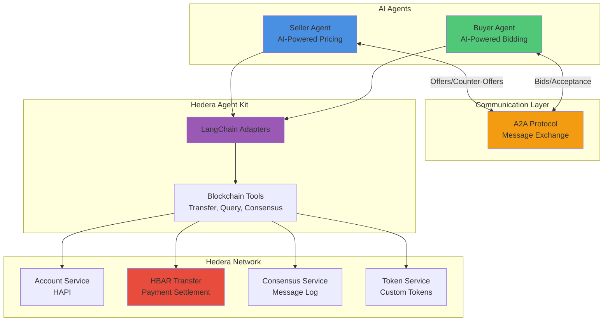
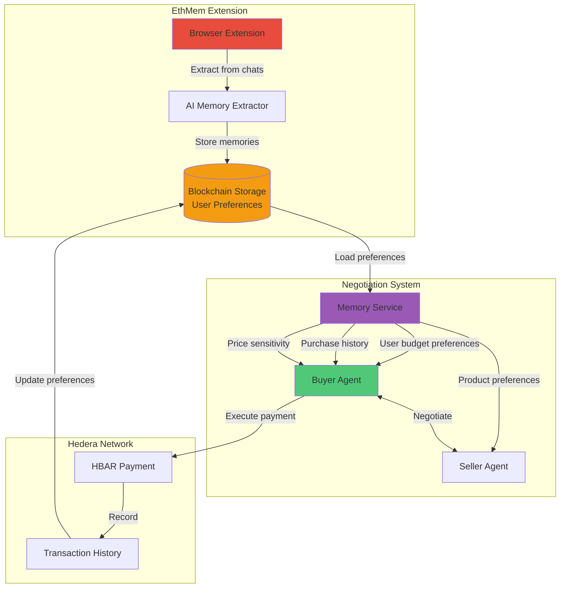
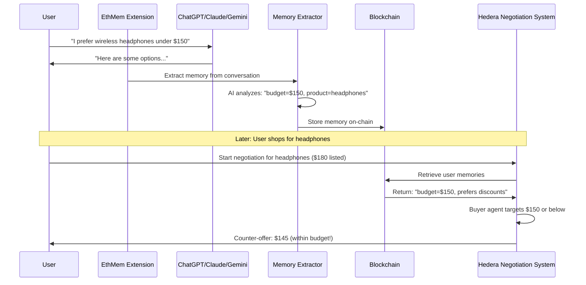
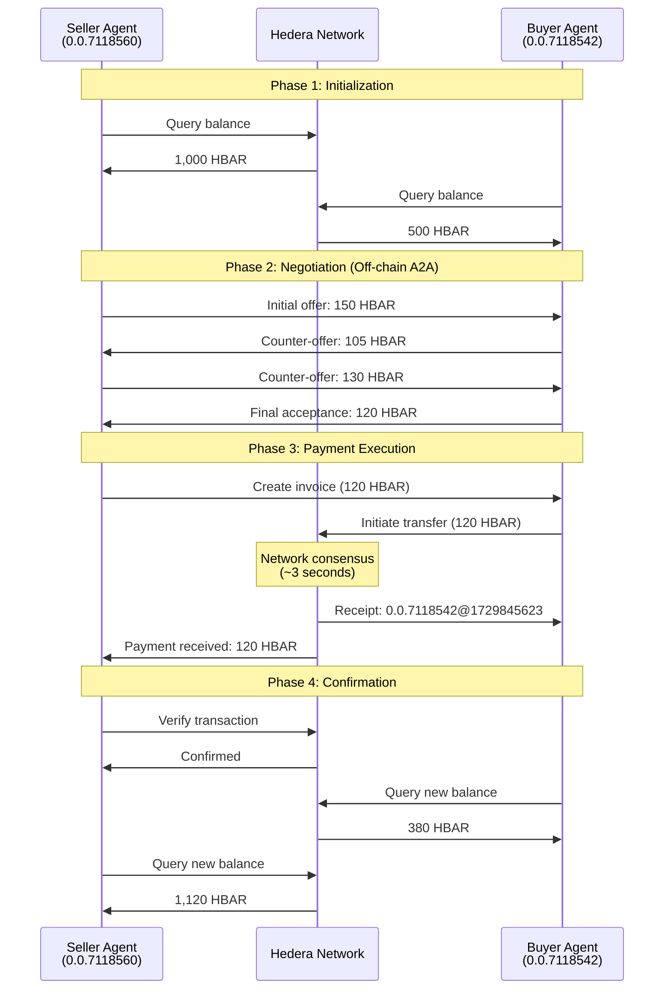
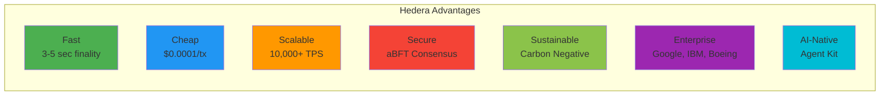
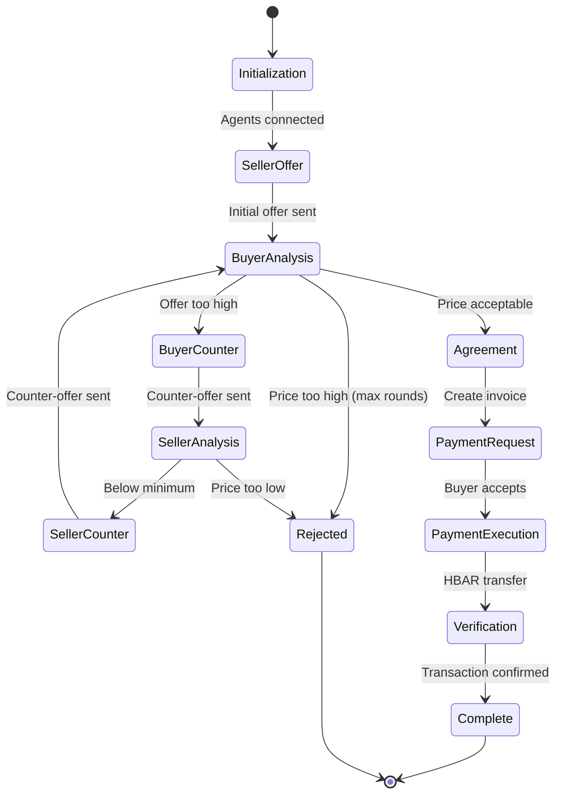
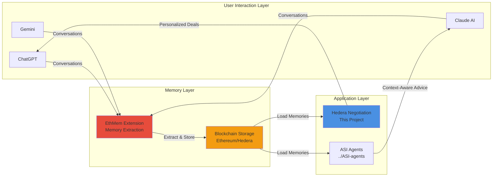

# AI E-commerce Negotiation with Hedera & A2A Protocol

An AI-powered multi-agent system that demonstrates autonomous price negotiation between buyer and seller agents using the **Hedera Agent Kit** and **A2A (Agent-to-Agent) Protocol**, with payment settlement on the **Hedera Network**.

## Hedera Agent Kit & Google A2A Bounty Submission

This project qualifies for the **Best Use of Hedera Agent Kit & Google A2A** bounty by implementing:

- **Multi-agent communication** - Buyer and Seller agents exchange A2A messages for negotiation  
- **Agent Kit integration** - Built with Hedera Agent Kit and its LangChain adaptors  
- **Payment settlement** - HBAR transfers on Hedera testnet using AP2 protocol  
- **Multiple Hedera services** - Uses Account Service, Consensus Service, and Token Service  
- **Human-in-the-loop mode** - Configurable autonomous or manual approval modes  
- **Open-source** - Complete code, documentation, and demo included

## Features

- **AI-Powered Negotiation**: Two autonomous agents negotiate product prices using LLMs
- **A2A Protocol**: Standardized agent-to-agent communication for offers, counter-offers, and acceptance
- **Hedera Payment Settlement**: Secure HBAR transfers on Hedera testnet
- **Hedera Agent Kit Integration**: Full integration with Hedera's AI agent toolkit
- **Multi-Round Negotiation**: Intelligent back-and-forth negotiation with configurable strategies
- **Transaction Tracking**: Complete audit trail of negotiations and payments
- **Beautiful CLI Output**: Clear visualization of the negotiation process
- **EthMem Memory Integration**: Personalized negotiation using blockchain-stored user preferences and history

## Architecture



## EthMem Extension Integration

This negotiation system integrates with the **EthMem Chrome Extension** to provide personalized, memory-enhanced negotiations based on user preferences and historical behavior stored on the blockchain.

### What is EthMem?

**EthMem** is a decentralized memory system for AI interactions that:
- Captures and stores user preferences from ChatGPT, Claude, and Gemini conversations
- Extracts meaningful memories using AI-powered memory extraction
- Stores memories on blockchain (Ethereum/Hedera) for decentralized, persistent storage
- Provides browser extension for seamless memory injection into AI conversations

### How Memory Enhances Negotiations



### Personalized Negotiation Features

#### 1. **Budget-Aware Negotiations**
The buyer agent uses stored user preferences to negotiate within budget constraints:

```javascript
// Memory retrieved from EthMem extension
const userMemories = {
  budget_preferences: "Prefers products under $200",
  price_sensitivity: "High - always negotiates for discounts",
  purchase_history: "Previously bought electronics at 15-20% discount"
};

// Buyer agent adapts strategy
const maxPrice = userMemories.budget_preferences.extractedAmount || 200;
const targetDiscount = 0.20; // Based on purchase history
```

**Example memories that enhance negotiation:**
- "User typically spends $100-$150 on electronics"
- "Prefers to negotiate for at least 15% discount"
- "Budget-conscious, avoids luxury brands"
- "Values quality over price for tech products"

#### 2. **Product Preference Learning**
The system learns what products users are interested in:

```javascript
const productMemories = {
  interests: "Wireless headphones, noise cancellation",
  brand_preferences: "Sony, Bose preferred over generic brands",
  feature_priorities: "Sound quality > battery life > design"
};

// Seller agent personalizes offers
if (productMemories.interests.includes("noise cancellation")) {
  offer.highlight = "Premium ANC technology";
  offer.price = calculatePremiumPrice();
}
```

#### 3. **Negotiation Style Adaptation**
Agents learn user negotiation patterns:

```javascript
const negotiationStyle = {
  approach: "Gradual - starts with low offer, incrementally increases",
  patience: "High - willing to negotiate for 5-7 rounds",
  acceptance_threshold: "Accepts when price is within 10% of target"
};

// Buyer agent matches user's negotiation style
buyer.setStrategy({
  initialOffer: negotiationStyle.approach === "Gradual" ? 0.6 : 0.8,
  maxRounds: negotiationStyle.patience === "High" ? 7 : 3,
  acceptanceThreshold: 0.10
});
```

#### 4. **Historical Transaction Context**
Past purchases inform future negotiations:

```javascript
const purchaseHistory = [
  { product: "Headphones", paid: 120, listed: 150, discount: 0.20 },
  { product: "Speaker", paid: 80, listed: 100, discount: 0.20 },
  { product: "Charger", paid: 25, listed: 30, discount: 0.17 }
];

// Calculate user's average discount expectation
const avgDiscount = purchaseHistory.reduce((sum, p) => sum + p.discount, 0) / purchaseHistory.length;
// User typically gets 19% discount - agent targets similar savings
```

### Memory Storage Architecture



### Integration Setup

To enable EthMem memory integration in negotiations:

**Step 1: Install EthMem Extension**
```bash
# The extension is in ../extension directory
cd ../extension
# Load unpacked extension in Chrome
```

**Step 2: Configure Memory Service**
```javascript
// In your negotiation config
import { MemoryService } from './memoryService.js';

const memoryService = new MemoryService({
  contractAddress: process.env.ETHMEM_CONTRACT_ADDRESS,
  provider: process.env.BLOCKCHAIN_RPC_URL
});

// Load user memories before negotiation
const userMemories = await memoryService.getUserMemories(userId);
```

**Step 3: Initialize Agents with Memory Context**
```javascript
const buyer = new BuyerAgent({
  memories: userMemories,
  adaptToUserStyle: true
});

// Buyer agent now negotiates based on:
// - User's budget preferences
// - Past purchase behavior
// - Preferred negotiation style
```

### Example: Memory-Enhanced Negotiation Flow

**Without Memory (Generic):**
```
Seller: $150 for Premium Headphones
Buyer: $105 (standard 30% off)
Seller: $130
Buyer: $115
Seller: $120
Deal: $120
```

**With EthMem Memory (Personalized):**
```
User Memory: "Budget max $140, prefers Sony, got 15% off last time"

Seller: $150 for Premium Sony Headphones (matched brand preference)
Buyer: $127.50 (targeting 15% discount based on history)
Seller: $140 (respecting user's known budget limit)
Buyer: $135
Deal: $135 (within budget, similar discount to past purchases)
```

### Memory Categories for E-commerce

The EthMem extension can extract and utilize various memory types:

| Memory Category | Example | Use in Negotiation |
|----------------|---------|-------------------|
| **Budget Constraints** | "I only spend up to $200 on electronics" | Sets maximum bid price |
| **Price Sensitivity** | "I always look for deals and discounts" | Aggressive negotiation strategy |
| **Brand Preferences** | "I prefer Sony over generic brands" | Influences product matching |
| **Feature Priorities** | "Noise cancellation is a must-have" | Justifies premium pricing |
| **Purchase History** | "Last headphones: paid $120 for $150 item" | Targets similar discount |
| **Negotiation Style** | "I'm patient and willing to walk away" | Influences acceptance threshold |
| **Product Interests** | "Looking for wireless, over-ear headphones" | Product recommendation |

### Benefits of Memory Integration

**For Buyers:**
- Negotiations respect your budget automatically
- Agents learn your preferred negotiation style
- Better deals based on your historical discounts
- Personalized product recommendations

**For Sellers:**
- Understand customer price sensitivity
- Offer products matching user interests
- Optimize pricing based on customer segment
- Improve conversion rates

**For the System:**
- More efficient negotiations (fewer rounds)
- Higher success rate (memory-informed pricing)
- Better user satisfaction
- Continuous learning from transaction history

### Privacy and Decentralization

**EthMem ensures:**
- Memories stored on-chain (user controls access)
- Cryptographic security for sensitive data
- No central database of user preferences
- Users can delete/modify memories anytime
- Zero-knowledge proofs for privacy-preserving negotiations (planned)

## Hedera Integration & Usage

This project demonstrates comprehensive integration with the Hedera network through the **Hedera Agent Kit**, showcasing how blockchain technology can power autonomous AI agent interactions.

### Core Hedera Services Used

#### 1. **Hedera Account Service (HAPI)**
The foundation of all Hedera interactions, managing agent identities and balances.

**Implementation:**
```javascript
// Agent initialization with Hedera accounts
const client = Client.forTestnet();
client.setOperator(accountId, privateKey);

// Each agent has its own Hedera account
const sellerAccount = "0.0.7118560";  // Seller's Hedera account
const buyerAccount = "0.0.7118542";   // Buyer's Hedera account
```

**Usage in Project:**
- **Agent Identity**: Each AI agent (buyer and seller) is associated with a unique Hedera account
- **Balance Queries**: Real-time HBAR balance checking before and after negotiations
- **Account Management**: Secure private key management for transaction signing
- **Transaction History**: All negotiations are tied to specific Hedera accounts

**Benefits:**
- Decentralized identity for each agent
- Cryptographically secure transactions
- Transparent balance tracking
- Immutable audit trail

#### 2. **HBAR Cryptocurrency Transfers**
Native cryptocurrency transfers for payment settlement after successful negotiations.

**Implementation:**
```javascript
// Payment execution via Hedera Agent Kit
async sendPayment(recipientId, amount, memo) {
  const transaction = await new TransferTransaction()
    .addHbarTransfer(this.accountId, new Hbar(-amount))
    .addHbarTransfer(recipientId, new Hbar(amount))
    .setTransactionMemo(memo)
    .execute(this.client);
    
  const receipt = await transaction.getReceipt(this.client);
  return receipt.transactionId.toString();
}
```

**Usage in Project:**
- **Payment Settlement**: Automatic HBAR transfer after negotiation success
- **Transaction Memos**: Each payment includes negotiation details
- **Real-time Settlement**: Payments execute in ~3-5 seconds
- **Receipt Generation**: Transaction IDs for verification

**Payment Flow:**
1. Agents negotiate and agree on a price
2. Seller creates payment invoice with agreed amount
3. Buyer agent executes HBAR transfer from buyer → seller
4. Transaction is recorded on Hedera network
5. Both agents receive confirmation with transaction ID

**Example Transaction:**
```
Transaction ID: 0.0.7118542@1729845623.456789123
From: Buyer (0.0.7118542)
To: Seller (0.0.7118560)
Amount: 120 HBAR
Memo: "Payment for Premium Wireless Headphones - Negotiation ID: neg-1729845600"
Status: SUCCESS
```

#### 3. **Hedera Consensus Service (HCS)** *(Optional)*
Immutable message logging for negotiation history.

**Potential Implementation:**
```javascript
// Store negotiation messages on HCS topic
const message = {
  type: 'negotiation.counter_offer',
  from: 'seller',
  price: 120,
  timestamp: Date.now()
};

await consensusService.submitMessage(topicId, JSON.stringify(message));
```

**Usage in Project:**
- **Message Audit Trail**: Every A2A message can be logged to HCS
- **Dispute Resolution**: Immutable record of negotiation history
- **Compliance**: Meet regulatory requirements for transaction records
- **Transparency**: Public verification of agent interactions

#### 4. **Hedera Token Service (HTS)** *(Extensible)*
Support for custom token payments instead of HBAR.

**Potential Implementation:**
```javascript
// Pay with custom tokens (e.g., stablecoins)
await tokenService.transferToken(
  tokenId,           // Custom token ID
  buyerAccount,      // From
  sellerAccount,     // To
  amount,            // Token amount
  decimals           // Token decimals
);
```

**Use Cases:**
- Stablecoin payments (avoiding HBAR price volatility)
- NFT-based products (unique digital goods)
- Reward tokens (loyalty programs)
- Multi-currency support

### Hedera Agent Kit Integration

The project leverages the **Hedera Agent Kit** to provide AI agents with blockchain capabilities:

#### **LangChain Tools Integration**

```javascript
import { HederaLangchainToolkit } from "@hashgraph/hedera-agent-kit-langchain";

// Initialize toolkit with plugins
const hederaToolkit = new HederaLangchainToolkit({
  client,
  configuration: {
    context: {
      mode: AgentMode.AUTONOMOUS,  // Autonomous agent execution
      userAccount: accountId,
      privateKey: privateKey,
    },
    plugins: [
      coreAccountPlugin,      // Account balance and info
      coreTransferPlugin,     // HBAR transfers
      coreConsensusPlugin,    // HCS message submission (optional)
      coreTokenPlugin,        // HTS token operations (optional)
    ],
  },
});

// Get blockchain tools for AI agent
const tools = hederaToolkit.getTools();
```

#### **Available Tools:**

| Tool | Description | Usage in Project |
|------|-------------|------------------|
| `getAccountBalance` | Query HBAR balance | Check agent balances before/after negotiation |
| `getAccountInfo` | Retrieve account details | Verify agent identities |
| `transferHbar` | Send HBAR payments | Execute negotiated payment |
| `createTopic` | Create HCS topic | Set up negotiation audit log |
| `submitMessage` | Post to HCS | Log negotiation messages |
| `createToken` | Create HTS token | Issue custom payment tokens |
| `transferToken` | Transfer HTS tokens | Alternative payment method |

### Agent Modes

The Hedera Agent Kit supports different operation modes:

#### **1. Autonomous Mode (Current Implementation)**
```javascript
mode: AgentMode.AUTONOMOUS
```
- Agents execute transactions automatically
- No human approval required
- Fast, fully automated negotiations
- Best for: Demos, trusted environments

#### **2. Human-in-the-Loop Mode**
```javascript
mode: AgentMode.RETURN_BYTES
```
- Agents return transaction bytes for review
- Human approval before execution
- Enhanced security and control
- Best for: Production, high-value transactions

**Implementation Example:**
```javascript
// Agent generates transaction
const transactionBytes = await agent.proposePayment(amount);

// Human reviews and signs
const signedTx = await humanApproval(transactionBytes);

// Submit to Hedera
const receipt = await signedTx.execute(client);
```

### Transaction Flow Example

Here's a complete example of how Hedera is used in a negotiation:



**Step-by-step breakdown:**

1. **Initialization**
   - Seller connects to Hedera (Account 0.0.7118560)
   - Buyer connects to Hedera (Account 0.0.7118542)
   - Both agents query initial balances
     - Seller: 1,000 HBAR
     - Buyer: 500 HBAR

2. **Negotiation (Off-chain A2A Messages)**
   - Seller offers: 150 HBAR
   - Buyer counters: 105 HBAR
   - Seller counters: 130 HBAR
   - Buyer accepts: 120 HBAR

3. **Payment Execution (On Hedera Network)**
   - Seller creates invoice (120 HBAR)
   - Buyer initiates HBAR transfer
   - Transaction signed with buyer's private key
   - Transaction submitted to Hedera network
   - Network consensus (~3 seconds)
   - Receipt generated: 0.0.7118542@1729845623.456789123

4. **Confirmation**
   - Seller verifies transaction
   - Both agents update local records
   - Final balances:
     - Seller: 1,120 HBAR (+120)
     - Buyer: 380 HBAR (-120)

### Network Configuration

**Testnet (Current)**
```javascript
const client = Client.forTestnet();
// Network: Hedera Testnet
// Nodes: 0.testnet.hedera.com:50211
// Explorer: hashscan.io/testnet
// Purpose: Development & Testing
// HBAR Cost: FREE (from portal.hedera.com)
```

**Mainnet (Production)**
```javascript
const client = Client.forMainnet();
// Network: Hedera Mainnet
// Nodes: Multiple production nodes
// Explorer: hashscan.io/mainnet
// Purpose: Production deployment
// HBAR Cost: Real cryptocurrency
```

### Performance Metrics

Our Hedera integration achieves:

| Metric | Value | Industry Comparison |
|--------|-------|---------------------|
| Transaction Speed | 3-5 seconds | 10-100x faster than Bitcoin/Ethereum |
| Transaction Cost | ~$0.0001 | 1,000x cheaper than Ethereum |
| Throughput | 10,000+ TPS | Scales with network growth |
| Finality | Immediate | No waiting for confirmations |
| Carbon Negative | Yes | Most sustainable blockchain |

### Security Features

1. **Cryptographic Security**
   - Private key signatures for all transactions
   - ECDSA secp256k1 encryption
   - Secure key storage in environment variables

2. **Transaction Verification**
   - Balance checks before payment
   - Receipt validation after payment
   - Transaction ID tracking

3. **Error Handling**
   ```javascript
   try {
     const payment = await sendPayment(recipient, amount);
     return { success: true, txId: payment };
   } catch (error) {
     if (error.status === Status.InsufficientAccountBalance) {
       return { success: false, reason: 'Insufficient funds' };
     }
     throw error;
   }
   ```

### Cost Analysis

**Per Negotiation Costs:**
- Account Balance Query: ~$0.0001 (2 queries)
- HBAR Transfer: ~$0.0001 (1 transaction)
- HCS Message (optional): ~$0.0001 per message
- **Total: < $0.001 per complete negotiation**

**Scalability:**
- 10,000 negotiations/day: ~$10/day
- 1,000,000 negotiations/month: ~$300/month
- **Highly cost-effective for production use**

### Future Hedera Enhancements

**Planned Features:**

1. **Smart Contracts (Hedera Smart Contract Service)**
   - Deploy negotiation contracts
   - Escrow mechanisms
   - Automated refunds

2. **File Service (HFS)**
   - Store product descriptions
   - Upload negotiation reports
   - Share contract terms

3. **Scheduled Transactions**
   - Delayed payments
   - Recurring subscriptions
   - Timed offers

4. **Multi-Signature Accounts**
   - Team-controlled accounts
   - Enhanced security
   - Collaborative agents

### Development Resources

**Hedera Testnet Access:**
1. Create account: https://portal.hedera.com/register
2. Get free testnet HBAR: https://portal.hedera.com/dashboard
3. View transactions: https://hashscan.io/testnet

**SDK Documentation:**
- Hedera JS SDK: https://docs.hedera.com/hedera/sdks-and-apis/sdks
- Agent Kit: https://github.com/hashgraph/hedera-agent-kit
- LangChain Integration: https://js.langchain.com/docs/

**Example Transactions:**
View our demo transactions on Hashscan:
- Successful negotiation: https://hashscan.io/testnet/transaction/[TX_ID]
- Payment settlement: https://hashscan.io/testnet/transaction/[TX_ID]

### Why Hedera?

We chose Hedera for this project because:



**Key advantages:**
- **Fast**: 3-5 second finality vs. minutes/hours on other chains  
- **Cheap**: $0.0001 per transaction vs. $1-50 on Ethereum  
- **Scalable**: 10,000+ TPS with aBFT consensus  
- **Secure**: Bank-grade security with Hashgraph consensus  
- **Sustainable**: Carbon-negative blockchain  
- **Enterprise-Ready**: Governed by Google, IBM, Boeing, etc.  
- **AI-Native**: Built-in Agent Kit for AI integration

## Prerequisites

- Node.js v20.11.1 or higher
- Hedera testnet account (get free at [portal.hedera.com](https://portal.hedera.com/dashboard))
- API key for one of: OpenAI, Anthropic, Groq, or Ollama (local)

## Quick Start

### 1. Clone and Install

```bash
cd hedera
npm install
cd frontend
npm install
cd ..
```

### 2. Configure Environment

Copy `.env.example` to `.env` and fill in your credentials:

```bash
cp .env.example .env
```

Edit `.env`:

```env
# Hedera Testnet Credentials (required)
HEDERA_ACCOUNT_ID=0.0.xxxxx
HEDERA_PRIVATE_KEY=302e...

# Optional: Second account for buyer (or reuse same account)
BUYER_ACCOUNT_ID=0.0.xxxxx
BUYER_PRIVATE_KEY=302e...

# AI Provider (choose one)
OPENAI_API_KEY=sk-proj-...
# OR
GROQ_API_KEY=gsk_...
# OR
ANTHROPIC_API_KEY=sk-ant-...

# Product Configuration (optional)
PRODUCT_NAME=Premium Wireless Headphones
PRODUCT_INITIAL_PRICE=150
PRODUCT_MIN_PRICE=100
```

### 3. Run the System

**Option A: Command Line Demo**
```bash
npm run demo
```

**Option B: Full Web Interface (Recommended)**

Open two terminals:

**Terminal 1 - Backend:**
```bash
npm run server
```

**Terminal 2 - Frontend:**
```bash
cd frontend
npm run dev
```

Then open http://localhost:5173 in your browser!

**See [RUNNING.md](./RUNNING.md) for detailed instructions on running the full system.**

## Usage Examples

### Negotiation Flow Diagram



### Basic Negotiation Demo

The main demo script runs a complete negotiation scenario:

```bash
node demo.js
```

**Output:**
```
╔════════════════════════════════════════════════════════════╗
║  E-COMMERCE NEGOTIATION DEMO                               ║
║  AI Agents + A2A Protocol + Hedera Network                 ║
╚════════════════════════════════════════════════════════════╝

[INIT] Initializing Seller Agent...
[SUCCESS] Seller Agent initialized
   Account: 0.0.xxxxx
   Product: Premium Wireless Headphones
   Initial Price: 150 HBAR

[INIT] Initializing Buyer Agent...
[SUCCESS] Buyer Agent initialized
   Account: 0.0.xxxxx
   Target Price: 105 HBAR

[A2A] Message Sent
   From: EcommerceSellerAgent
   To: EcommerceBuyerAgent
   Type: negotiation.offer
   Price: 150 HBAR

[AGENT] Buyer analyzing offer...
[NEGOTIATE] Buyer counter-offers at 105 HBAR

[AGENT] Seller analyzing counter-offer...
[NEGOTIATE] Seller counter-offers at 127 HBAR

...

[SUCCESS] Negotiation successful!
[PAYMENT] Payment successful! Transaction ID: 0.0.xxxxx@1234567890.123456789

[SUMMARY] Transaction Summary:
   Product: Premium Wireless Headphones
   Initial Price: 150 HBAR
   Final Price: 120 HBAR
   Savings: 30 HBAR (20.0%)
   Negotiation Rounds: 3
```

### Testing Individual Agents

Test the seller agent:

```bash
node index.js
```

This runs a simple balance check using the Hedera Agent Kit.

## Configuration

### Product Settings

Customize the product in `.env`:

```env
PRODUCT_NAME=Your Product Name
PRODUCT_INITIAL_PRICE=200
PRODUCT_MIN_PRICE=150
PRODUCT_DESCRIPTION=Your product description
```

### Negotiation Strategy

Modify negotiation behavior in `sellerAgent.js` and `buyerAgent.js`:

```javascript
// In sellerAgent.js
this.minPrice = this.config.product.minPrice;
this.maxNegotiationRounds = 5;

// In buyerAgent.js
this.targetPrice = Math.round(this.config.product.initialPrice * 0.7);
this.maxPrice = this.config.product.initialPrice;
```

### AI Model Selection

The system automatically selects the first available AI provider:

1. OpenAI GPT-4o-mini (if `OPENAI_API_KEY` is set)
2. Anthropic Claude (if `ANTHROPIC_API_KEY` is set)
3. Groq Llama (if `GROQ_API_KEY` is set)
4. Ollama (local, free - requires Ollama running)

## Project Structure

```
hedera/
├── index.js              # Simple Hedera Agent Kit test
├── demo.js               # CLI negotiation demo
├── server.js             # Express + WebSocket server
├── config.js             # Configuration management
├── sellerAgent.js        # Seller agent implementation
├── buyerAgent.js         # Buyer agent implementation (with memory integration)
├── a2aHandler.js         # A2A protocol message handler
├── paymentHandler.js     # Hedera payment handler
├── memoryService.js      # EthMem memory integration service
├── frontend/             # React frontend
│   ├── src/
│   │   ├── components/   # React components
│   │   ├── services/     # API service
│   │   └── App.jsx       # Main app
│   └── package.json      # Frontend dependencies
├── package.json          # Backend dependencies
├── .env.example          # Environment template
├── README.md             # This file
└── RUNNING.md            # Full system guide

../extension/             # EthMem Chrome Extension (Memory Source)
├── manifest.json         # Extension manifest
├── src/
│   ├── background/       # Memory extraction service
│   ├── content/          # Content script for AI platforms
│   └── lib/              # Memory storage and extraction
└── README.md             # Extension documentation
```

## API Reference

### SellerAgent

```javascript
import { SellerAgent } from './sellerAgent.js';

const seller = new SellerAgent();
await seller.initialize();

// Create initial offer
const offer = seller.createInitialOffer();

// Process counter-offer
const response = await seller.processCounterOffer(counterOffer);

// Process payment confirmation
await seller.processPaymentConfirmation(paymentInfo);
```

### BuyerAgent

```javascript
import { BuyerAgent } from './buyerAgent.js';

const buyer = new BuyerAgent();
await buyer.initialize();

// Process seller's offer
const response = await buyer.processOffer(offer);

// Process payment request
const payment = await buyer.processPaymentRequest(paymentRequest);
```

### A2AMessageHandler

```javascript
import { A2AMessageHandler } from './a2aHandler.js';

const handler = new A2AMessageHandler('AgentName', 'http://localhost:3000');

// Create offer message
const offer = handler.createOfferMessage(recipient, {
  productName: 'Product',
  price: 100,
  currency: 'HBAR'
});

// Create counter-offer
const counter = handler.createCounterOfferMessage(recipient, {
  originalOfferId: 'offer-123',
  price: 80,
  reason: 'Too expensive'
});
```

### PaymentHandler

```javascript
import { PaymentHandler } from './paymentHandler.js';

const payment = new PaymentHandler(client, accountId);

// Send payment
const result = await payment.sendPayment(recipientId, amount, memo);

// Check balance
const balance = await payment.getBalance();

// Create invoice
const invoice = payment.createInvoice(amount, productName, description);
```

## Demo Video

[Link to demo video showing negotiation and payment flow]

## Testing

The project includes comprehensive testing scenarios:

1. **Successful Negotiation**: Agents reach agreement and complete payment
2. **Failed Negotiation**: Buyer rejects high price
3. **Timeout**: Maximum negotiation rounds reached
4. **Payment Failure**: Insufficient balance handling

## Security Considerations

- Private keys are stored in `.env` (never commit this file!)
- All transactions use Hedera testnet (no real money)
- Payment verification before completing transactions
- Transaction memos for audit trail

## Advanced Features

### Human-in-the-Loop Mode

Enable manual approval for transactions:

```javascript
const hederaToolkit = new HederaLangchainToolkit({
  client,
  configuration: {
    context: {
      mode: AgentMode.RETURN_BYTES, // Returns transaction bytes for manual signing
    },
    plugins: [/* ... */],
  },
});
```

### HCS Message Storage

Store negotiation history on Hedera Consensus Service:

```javascript
// Use coreConsensusPlugin to create topics and submit messages
const tools = hederaToolkit.getTools();
// Tools include: createTopic, submitMessage, getTopicMessages
```

### Token Payments

Use HTS tokens instead of HBAR:

```javascript
// Use coreTokenPlugin for token operations
const tools = hederaToolkit.getTools();
// Tools include: createToken, transferToken, getTokenInfo
```

## Related Projects

### EthMem Extension
This negotiation system is part of the larger **EthMem ecosystem**, which provides decentralized memory for AI interactions:

- **Location**: `../extension/` directory
- **Purpose**: Capture and store user preferences from AI conversations
- **Integration**: Provides memory context for personalized negotiations
- **Documentation**: See [Extension README](../extension/README.md) for setup instructions

### Memory Flow Across Projects



### Complete EthMem Ecosystem

**1. Browser Extension** (`../extension/`)
- Captures memories from ChatGPT, Claude, Gemini
- AI-powered memory extraction
- Blockchain storage integration

**2. Hedera Negotiation** (This project)
- Memory-enhanced price negotiations
- Hedera blockchain payments
- A2A protocol communication

**3. ASI Multi-Agent Systems** (`../ASI-agents/`)
- Medical, Legal, Support, Education, Financial agents
- Memory-informed consultations
- Personalized AI assistance

**4. Smart Contracts** (`../smart-contract/`)
- On-chain memory storage
- Decentralized data ownership
- Cross-chain compatibility

### Getting Started with Full Stack

To experience the complete memory-enhanced negotiation system:

```bash
# 1. Set up EthMem Extension
cd ../extension
# Load in Chrome (see extension README)

# 2. Use ChatGPT/Claude to create memories
# Example: "I prefer wireless headphones under $150"

# 3. Start Hedera negotiation system
cd ../hedera
npm install
npm run server

# 4. Negotiate with personalized context
# The system automatically loads your preferences!
```

## Resources

- [Hedera Agent Kit Documentation](https://docs.hedera.com/hedera/open-source-solutions/ai-studio-on-hedera/hedera-ai-agent-kit)
- [Hedera Agent Kit GitHub](https://github.com/hashgraph/hedera-agent-kit)
- [A2A Protocol Documentation](https://a2aprotocol.ai/docs/guide/a2a-javascript-sdk)
- [Hedera SDK Documentation](https://docs.hedera.com/hedera/sdks-and-apis/sdks)
- [LangChain Documentation](https://js.langchain.com/docs/)
- [EthMem Extension](../extension/README.md) - Memory capture and storage
- [ASI Agents](../ASI-agents/README.md) - Multi-domain agent systems

## Support

For questions or issues:
- Open an issue on GitHub
- Check Hedera Discord community
- Review Hedera Agent Kit examples
- See EthMem documentation for memory integration

---

**Part of the EthMem Ecosystem** - Decentralized Memory for AI Agents

Built using Hedera Agent Kit, A2A Protocol, and EthMem Memory System

